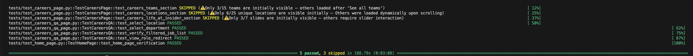

## Evren_Aktas_Case


- Testler hem **grafik arayüzlü** hem de **headless** modda çalışacak şekilde yapılandırılmıştır.
- Projeye merkezi bir **loglama altyapısı** entegre edilmiştir; her adımda detaylı test çıktıları izlenebilir.
- Yapı tamamen **POM** prensibine uygun olarak oluşturulmuştur.
- Sayfa etkileşimleri için kullanılan **selector’lar optimize edilmiş XPath ve CSS seçimlerinden** oluşmaktadır.


## Kurulum ve Testlerin Çalıştırılması

1. Gerekli paketleri yükleyin:
```bash
pip install -r requirements.txt

pytest tests/ -v
```


> **2. Madde NOT:**  
> Bu testlerde blokların (Teams, Locations, Life at Insider) sayfa yüklendiğinde **tamamen görünür olup olmadıkları** kontrol edilmiştir.  
> Ancak içeriklerin bir kısmı varsayılan olarak gizlenmiş ve kullanıcı etkileşimi (örneğin "See all teams" butonuna tıklamak, slider ile gezinmek) ile yüklenmektedir.  
> 
> Bu maddeyi tam olarak anlayamadığım için bu şekilde yapmak istedim. Test sonuçlarında da bu durumu SKIPPED olarak ele alıp açıklama ekledim. 
> Ek olarak alternatif kontrolüde ekledim. (Yorum satırı olarak)


### 1 - Visit https://useinsider.com/ and check Insider home page is opened or not  
**Sayfa tanımı:** `pages/home_page.py`  
**Test dosyası:** `tests/test_home_page.py`  

**Kontrol edilenler:**
- Web sayfasının HTTP yanıt kodunun 200 (başarılı) olup olmadığı.
- Sayfanın `<meta property="og:site_name" content="Insider">` meta etiketini içerip içermediği.
- Sayfanın URL’inin beklenen adresle uyumlu olup olmadığı.

---

### 2 - Select the “Company” menu in the navigation bar, select “Careers” and check Career page, its Locations, Teams, and Life at Insider blocks are open or not  
**Sayfa tanımı:** `pages/careers_page.py`  
**Test dosyası:** `tests/test_careers_page.py`  

**Kontrol edilenler:**
- **Teams bölümü** 
- **Locations bölümü** 
- **Life at Insider bölümü** 

---

### 3.1 - Go to https://useinsider.com/careers/quality-assurance/, click “See all QA jobs”, filter jobs by Location: “Istanbul, Turkey” , and Department: “Quality Assurance”, check the presence of the jobs list  
### 3.2 - Check that all jobs’ Position contains “Quality Assurance”, Department contains “Quality Assurance”, and Location contains “Istanbul, Turkey”  
### 3.3 - Click the “View Role” button and check that this action redirects us to the Lever Application form page  
**Sayfa tanımı:** `pages/careers_qa_page.py`  
**Test dosyası:** `tests/test_careers_qa_page.py`  

**Kontrol edilenler:**
- `https://useinsider.com/careers/quality-assurance/` sayfasına gidilip "See all QA jobs" butonuna tıklanarak pozisyon listesinin yüklendiği.
- Location filtresinden "Istanbul, Turkiye" seçilerek filtrelemenin başarıyla uygulandığı.
- Department filtresinden "Quality Assurance" seçilerek filtrelemenin başarıyla uygulandığı.
- Filtreleme sonrası listelenen tüm pozisyonların:  
    - Lokasyon bilgisinin "Istanbul, Turkiye" olduğu,  
    - Departman bilgisinin "Quality Assurance" olduğu doğrulanır.
- Her bir iş kartında yer alan "View Role" butonuna tıklanıldığında, pozisyon detay sayfasının Lever başvuru sayfası (`jobs.lever.co`) olduğu doğrulanır.


---

Örnek çıktı:



